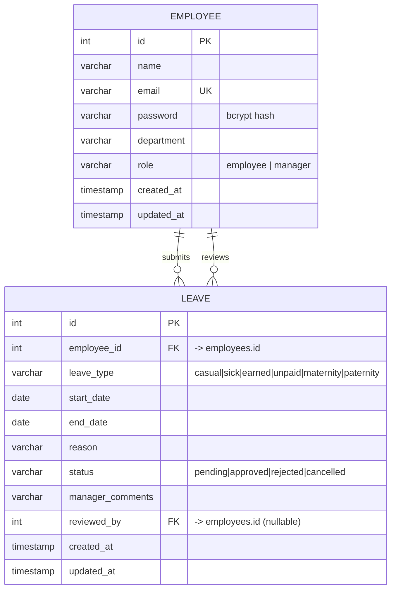

# Entity Relationship Diagram

The schema is normalized to **3NF**. Two entities model the domain; a manager is
an `employee` row with `role = 'manager'`, avoiding a redundant users table.

## Relationships
- **Employee → Leave (submits):** one-to-many via `leaves.employee_id`
  (`ON DELETE CASCADE` — removing an employee removes their requests).
- **Employee → Leave (reviews):** one-to-many via `leaves.reviewed_by`
  (`ON DELETE SET NULL` — self-referencing to the manager who acted on it).

## Keys & Constraints
- **Primary keys:** `employees.id`, `leaves.id`.
- **Unique:** `employees.email`.
- **Foreign keys:** `leaves.employee_id`, `leaves.reviewed_by`.
- **Check constraints:** enumerated `role`, `leave_type`, `status`;
  `end_date >= start_date`.

## Indexing Strategy
- `employees.email` (unique) — fast login lookups.
- `employees.role` — filter managers vs. employees.
- `leaves.employee_id`, `leaves.status`, `leaves.leave_type` — power the
  dashboard aggregates and history filtering without full scans.

## Scalability Considerations
- Indexes cover the hot query paths (login, per-employee history, status filters).
- The schema is dialect-portable (SQLite for the MVP, PostgreSQL for production).
- Statuses/types are enums, keeping rows compact and queries index-friendly.
- Future growth (departments, teams, leave balances) can be added as separate
  tables without breaking existing relationships.
